This is the app we developed for the second phase of the project. Please take a look and feel free to provide any suggestions.

I started working on an Android project in the second half of the year, which is the second phase of a previous project.  It didn't take much time overall, with most of the time spent on app store submission and application processes. The functionality is relatively simple. The difficulty with industrial software lies mainly in integrating various processes, unlike internet software where the logic is much simpler.  The error prevention and validation logic that needs to be handled is quite complex. Does anyone have relevant experience? Please share your insights!

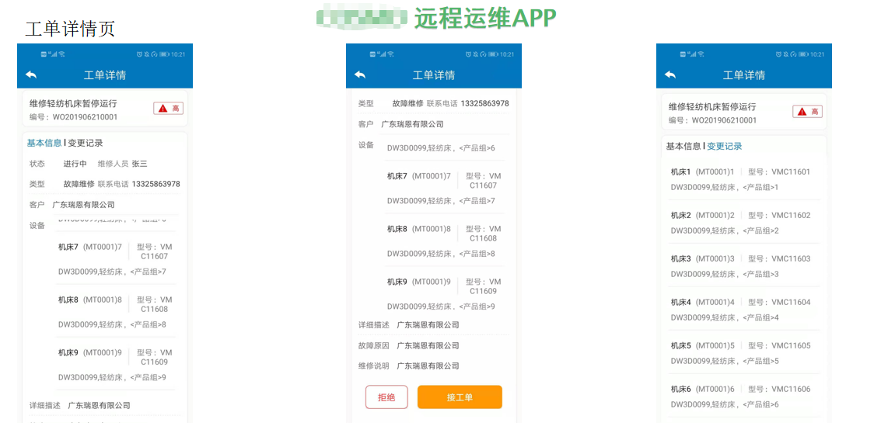 
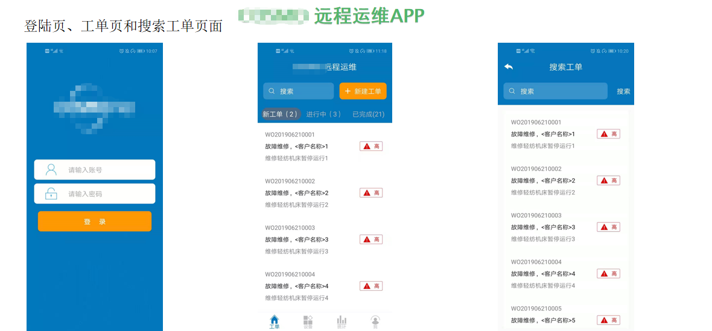 
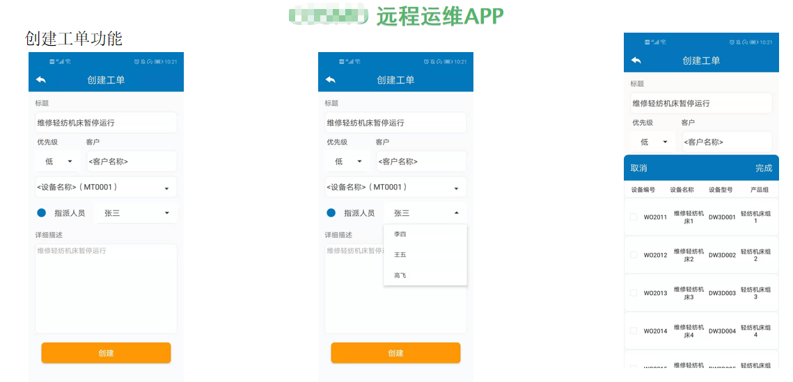 
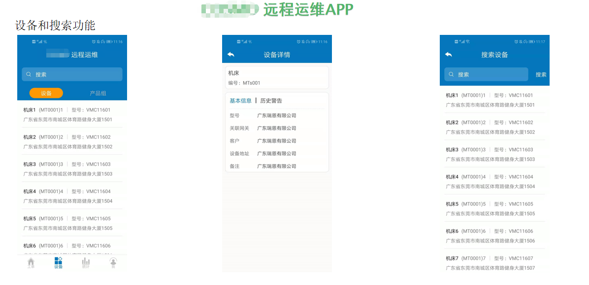 
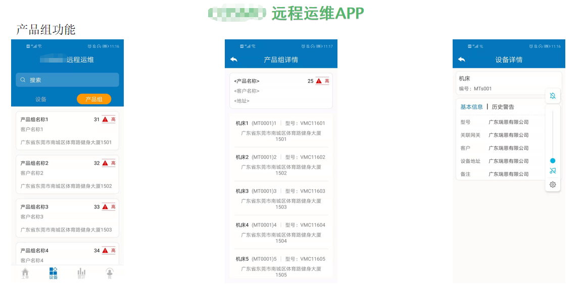 
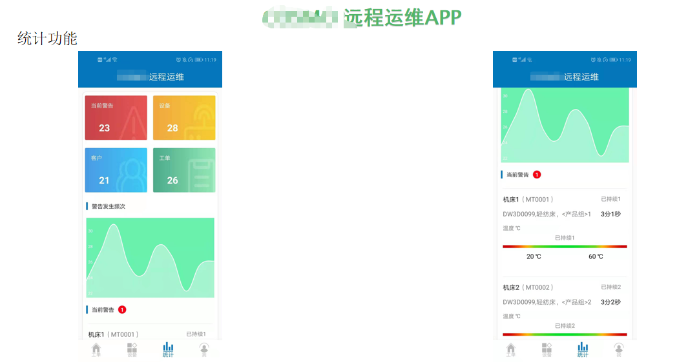 
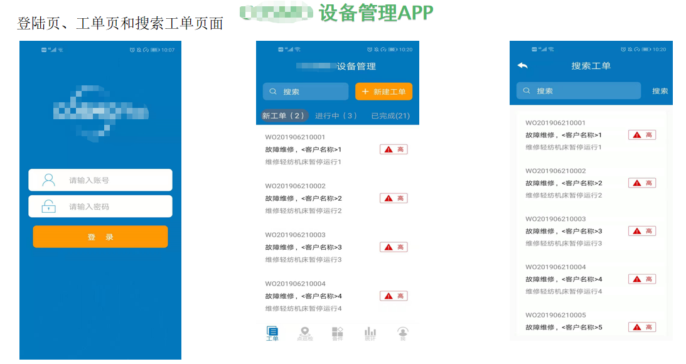 
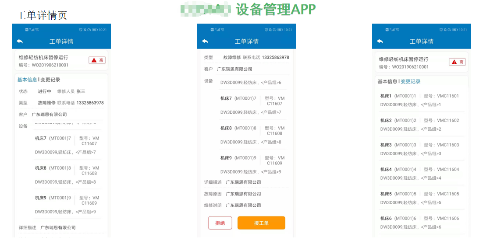 
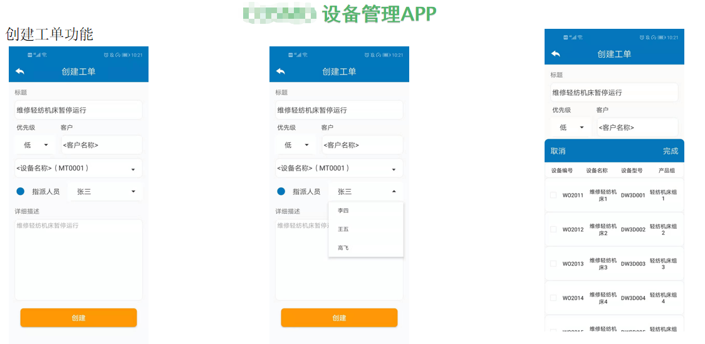 
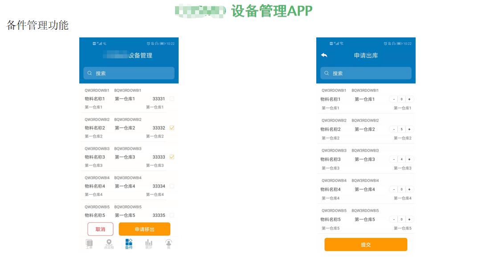 
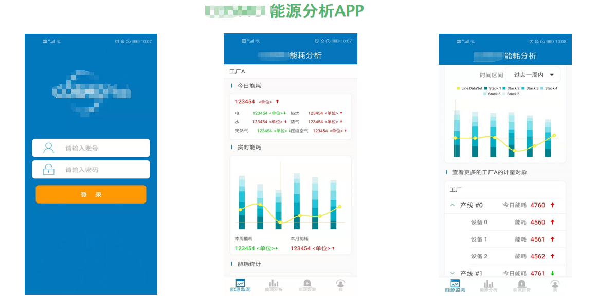 
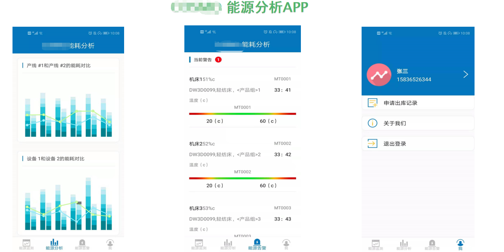 
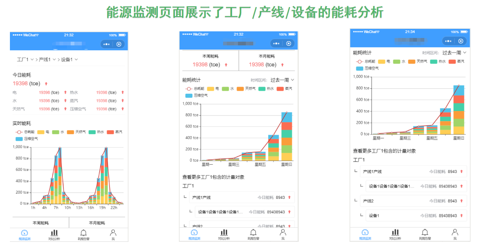 
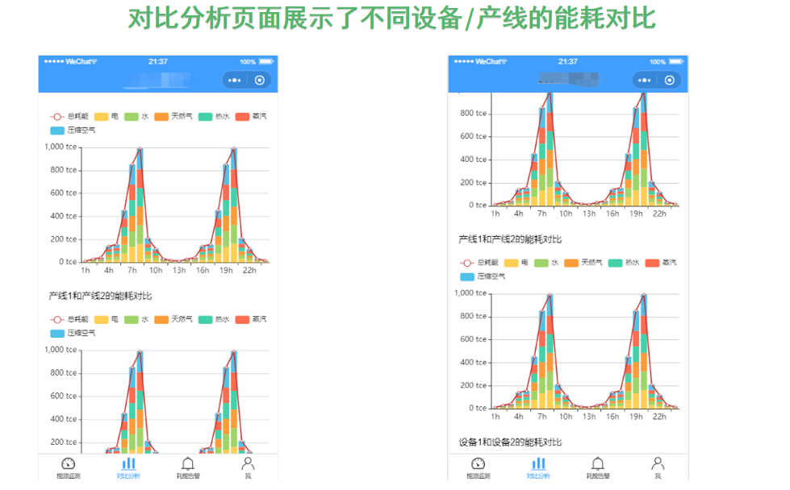 
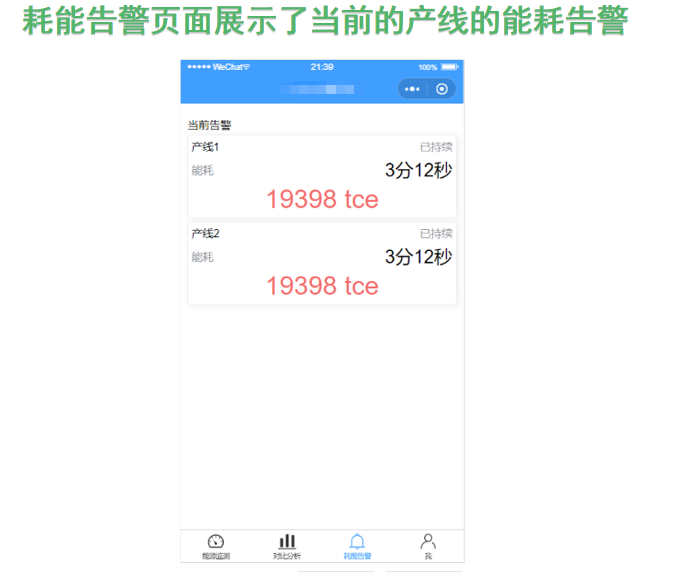